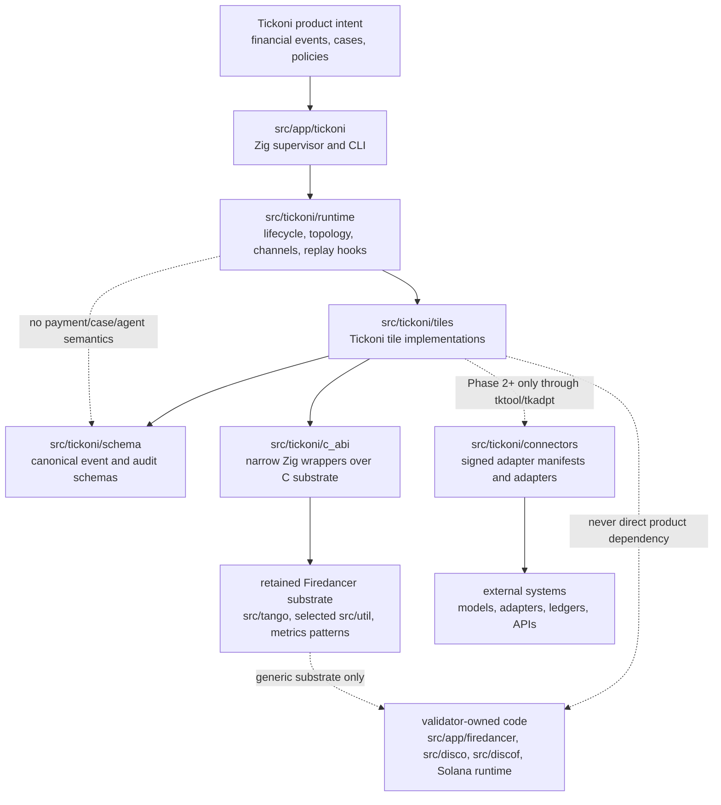
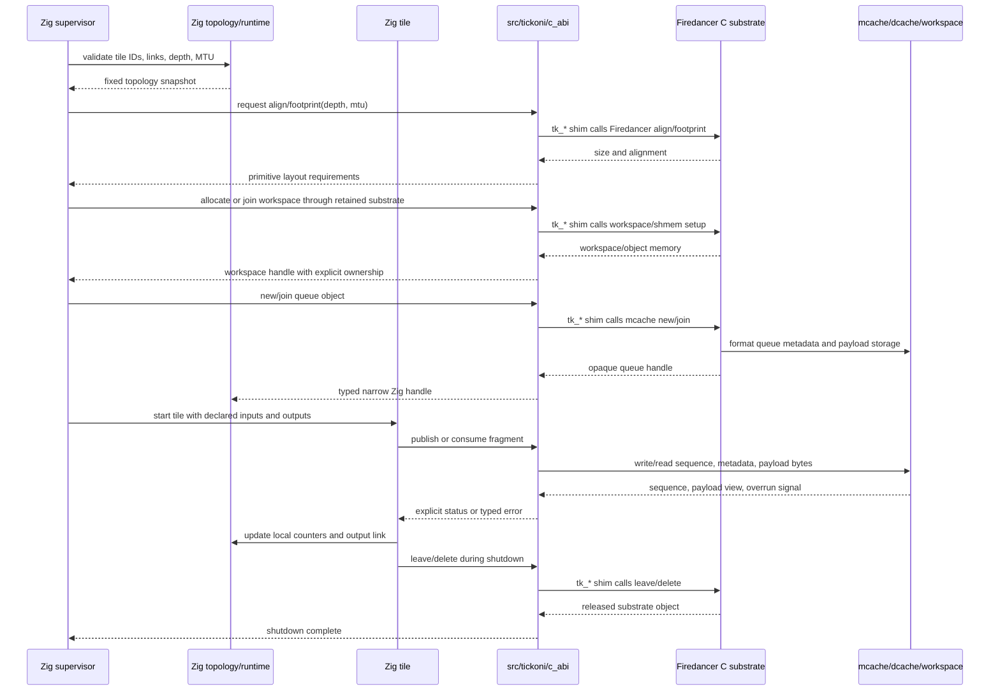

# Tickoni Zig Runtime Philosophy And Style Guide

This document is the detailed engineering guide for the Zig-native Tickoni
runtime. Repository-wide contribution workflow, test-command selection, and
pull-request expectations are defined in
[`CONTRIBUTING.md`](../../../CONTRIBUTING.md). The retained C substrate has its
own self-contained [`firedancer.md`](firedancer.md) contributor guide.

This guide carries Firedancer's explicit ownership, bounded-memory, and
isolation philosophy into Tickoni without mixing product logic into retained
validator code or hiding runtime boundaries behind comfortable abstractions.

Read "Tickoni" here as:

- `src/app/tickoni`: Zig supervisor, CLI, and process lifecycle entrypoints
- `src/tickoni/runtime`: topology, channels, tile handles, lifecycle, metrics,
  backpressure, and replay/runtime support
- `src/tickoni/c_abi`: narrow Zig declarations and wrappers around retained
  Firedancer C substrate
- `src/tickoni/codec`: Zig/C codec bindings and implementations for canonical
  schema encodings
- `src/tickoni/schema`: Tickoni financial event, policy, audit, case, and
  capability schemas; protobuf sources live under `src/tickoni/schema/proto`
- `src/tickoni/tiles`: Tickoni-owned tile implementations
- `src/tickoni/test/demo`: deterministic CLI and test demo orchestration
- `src/tickoni/connectors`: signed adapter manifests and adapter code, when
  that phase exists

Do not use this guide as permission to edit `src/app/firedancer`,
`src/disco`, `src/discof`, `src/tango`, or `src/util` for Tickoni convenience.
Those paths remain upstream substrate unless a change is genuinely generic and
reviewed as such.

This guide also adopts the parts of TigerStyle that fit Tickoni: safety before
performance, performance before developer convenience; bounded control flow;
startup allocation; dense executable invariants; deliberate naming; and design
work before implementation. These rules are adapted to Tickoni's financial,
auditable, replayable, process-isolated runtime rather than copied as
ledger-specific policy.

## Design Priorities

Tickoni optimizes for:

1. safety,
2. performance,
3. developer experience.

The order matters. A convenient API is not an improvement if it weakens
ownership, replay, audit, bounds, or isolation. A faster path is not acceptable
if it makes financial behavior non-deterministic or unauditable. Within those
constraints, the code should remain direct, readable, and economical.

Simplicity is not the first implementation that happens to work. It is the
result of revision: finding one design that satisfies ownership, capacity,
failure behavior, observability, and performance together. Spend design effort
before code because topology, schema, allocation, and authority mistakes become
far more expensive after data and money depend on them.

Tickoni does not knowingly defer correctness debt in shipped paths. A phase may
lack features, but the behavior that exists must satisfy its stated bounds,
audit, replay, isolation, and failure contracts. Do not merge a temporary
unbounded queue, silent fallback, incomplete audit path, or sandbox bypass on
the assumption that it will be fixed later.

## Source-Tree Guide

Use this table to decide where new code belongs. When a path is ambiguous,
ask rather than guess — misplaced code makes the ownership invariants stated
in CLAUDE.md harder to enforce.

| What you are adding | Where it belongs |
| --- | --- |
| Tile lifecycle, topology descriptors, channel handles, metrics surfaces, replay hooks, process/sandbox config | `src/tickoni/runtime/` |
| Narrow Zig `extern` declarations and small wrappers over retained Firedancer C substrate | `src/tickoni/c_abi/` |
| Canonical cross-tile financial event, policy, audit, case, and capability schemas that must be shared across tile boundaries | `src/tickoni/schema/` |
| Protobuf wire definitions for canonical schemas | `src/tickoni/schema/proto/<domain>/` |
| Binary, JSONL, protobuf, and hash codec implementations for canonical schemas | `src/tickoni/codec/` |
| Tile-owned implementation code: request/response types used only within one tile, tile run loop, backend variants, validators, dispatchers | `src/tickoni/tiles/<tile>/` — use `types.zig` for pure type definitions, `messages.zig` for request/response message types |
| Deterministic demo orchestration code imported by the CLI and multiple tests (for example the investment demo flow) | `src/tickoni/test/demo/<demo>/` |
| Pure test doubles (`MockBackend`), HTTP mock servers, and other test-only helpers not needed in production | `src/tickoni/test/mocks/` |
| Financial fixture data files (JSON, binary) used by demo and integration tests | `src/tickoni/test/fixtures/`; scenario data belongs under a `scenarios/` child directory |

### Naming rules within a tile directory

- `mod.zig` — public surface; re-exports types and functions from sibling files.
- `types.zig` — tile-local type definitions (enums, structs, payload types) that
  do not cross tile boundaries.
- `messages.zig` — tile-local request/response message types (e.g. `TkModlRequest`,
  `AdapterRequest`) passed between the tile and its callers.
- `backend.zig` — backend variants and the `Backend` tagged union.
- `validator.zig` — input validation and scope checking.
- `run.zig` — orchestration of a governed request through validation and backend.
- `codec.zig` — binary and JSONL encoding/decoding for tile-owned formats.
- `fixture_*.zig` — fixture builders used in tests within this tile.

Do not name any tile-local file `schema.zig`. That name is reserved for files
under `src/tickoni/schema/` that define canonical cross-tile contracts.

The Tickoni tile pattern is closer to Firedancer's tile boundary shape than to
MVC or MVVM. Each tile has a public module, explicit local contracts, optional
backend strategy, validation, and run orchestration. Use this skeleton when a
tile has enough behavior to split:

```text
src/tickoni/tiles/<tile>/
  mod.zig          public surface and re-exports
  types.zig        tile-owned pure types
  messages.zig     tile request/response messages
  backend.zig      tagged-union backend strategy
  validator.zig    fail-closed input and scope validation
  run.zig          orchestration through validate -> backend -> response
  codec.zig        tile-owned encodings, only when needed
  fixture_*.zig    tile-local fixture builders, only for tests
```

Small placeholder tiles may temporarily have only `mod.zig`, but once a tile
owns request/response messages, backend variants, validation, or orchestration,
put that code in the named file above instead of growing `mod.zig`.

## Core Rule

Tickoni is a financial event runtime first and an AI harness second.

The implementation order is:

```text
runtime first
cases second
agents third
privileged actions last
```

Do not introduce agents, model calls, adapters, UI state, or privileged action
execution into the deterministic event path. A payment event must be ingestible,
normalized, deduplicated, policy-checked, audited, and replayable without
running a model.

## Preserve The Firedancer Shape

Zig may make code safer and clearer, but it must not make the system less
explicit. The Firedancer inheritance worth keeping is:

- explicit topology over discovery
- fixed capacity over unbounded allocation
- one writer for hot mutable state
- bounded channels over unbounded message queues
- process isolation over in-process trust
- concrete restart, overrun, shutdown, and telemetry behavior
- mechanical simplicity in hot loops

The reader should still be able to answer the Firedancer questions for every
Tickoni change:

1. Which tile owns this state?
2. Which workspace or allocation holds it?
3. Which process maps or owns it, and in what mode?
4. Which fields are written concurrently, and by whom?
5. What is the overrun, restart, and shutdown behavior?
6. Which metrics or logs tell an operator it is unhealthy?

If those answers are vague, do not add the code yet.

### Process Mode And CPU Placement

For runtime hardening work, process isolation means separate OS processes, not
just separate Zig or pthread threads in one address space. Thread-backed mode is
allowed only as a fast dev/test compatibility lane unless the story explicitly
says otherwise.

When a change claims process-mode tile isolation, it must expose enough
evidence to identify:

- the supervisor PID;
- one child PID or equivalent thread-group/process id per configured tile;
- tile id, kind/index, configured CPU placement mode, and assigned CPU when
  pinned;
- the parent/child launch record that ties tile processes to the supervisor;
- whether the tile is `exclusive`, `shared`, or `floating`.

Tickoni owns CPU placement policy. Do not change Firedancer validator
auto-layout semantics or add Tickoni product fields to `fd_topo_t` to support
shared-core placement. Valid placement modes are:

- `exclusive`: one tile process pinned to one CPU;
- `shared`: multiple explicitly declared tile processes may reuse one CPU;
- `floating`: no fixed CPU pinning.

Undeclared oversubscription, malformed CPU ids, and unavailable CPU ids must
fail closed. Shared-core placement is a lower-throughput mode and must be
visible in supervisor output, metrics, diagnostics, or test evidence.

## Separation Rules

Keep these boundaries hard.

### Separation Diagram

The runtime separation should look like this:



The dotted lines are warning lines. They should trigger design review, not
become convenience paths.

### Validator Substrate vs Product Runtime

Allowed:

- wrap stable Firedancer substrate behind `src/tickoni/c_abi`
- reuse `src/tango` queue concepts, `src/util/sandbox`, metrics patterns, and
  topology/process-lifecycle ideas
- import upstream fixes into retained substrate deliberately

Not allowed:

- add Tickoni fields to Firedancer topology structs for product convenience
- rename Solana validator tiles into financial tiles
- put financial event schemas in `src/disco`, `src/discof`, or `src/flamenco`
- make the Tickoni product binary depend on Solana protocol tiles
- keep whole-tree merge pressure as an excuse to preserve unused validator code

When in doubt, add a narrow wrapper in `src/tickoni/c_abi` or a Tickoni-owned
module, not a product hook in upstream C.

### Reusing Firedancer Code Well

Reuse more of Firedancer by reusing real substrate paths, not by copying one
convenient header and faking the rest of the environment around it.

Rules:

- keep `src/tickoni/c_abi` narrow: Zig `extern` declarations, layout checks,
  and small wrappers that preserve C ownership semantics
- for process-mode tile links, prefer real Firedancer substrate:
  `src/tango/mcache`, `src/tango/dcache`, `src/tango/fseq` or
  `src/tango/fctl`, `src/tango/cnc`, workspace/shared-memory mechanics,
  `src/disco/topo` process/workspace patterns, and `src/util/sandbox`
- put Tickoni-owned schema, codec, export, and domain logic in Tickoni-owned
  modules such as `src/tickoni/codec`, not under `src/tickoni/c_abi`
- use `src/tickoni/c_abi/queue.zig` and `src/tickoni/c_abi/sandbox.zig` as
  the expected shape for Firedancer-facing bindings
- do not add business-adjacent C implementation under the ABI folder just
  because Zig calls it through `extern`
- prefer existing Firedancer-native primitives before introducing new third-
  party substrate, but reuse them through explicit ownership boundaries
- if a Firedancer helper path pulls in logging, asserts, SIMD assumptions, or
  runtime symbols, either link the real Firedancer substrate deliberately or
  drop to a more explicit lower-level path
- prefer portable wire/token paths when the convenience inline/helper path
  drags in hidden runtime dependencies that do not belong at the boundary
- do not fake Firedancer log/runtime symbols in product integration code just
  to satisfy linkage; that is a temporary test shim at best, not a healthy
  architectural shape
- treat sanitizer disables, alignment exceptions, and one-off compile defines
  in bridge code as integration smell; they usually mean the chosen reuse path
  is too implicit or owns too much
- keep binary encoding, readable export, replay transforms, and audit-domain
  schema ownership together in the owning Tickoni module, then keep the ABI
  layer mechanical and thin

If the bridge starts needing symbol stubs, build exceptions, or ownership that
cannot be explained in one sentence, stop and move the logic back into a
Tickoni-owned module. The goal is to reuse Firedancer substrate faithfully,
not to hide new product code behind the ABI membrane.

### Runtime Boundary Tests

Runtime process/shared-memory work needs negative tests as well as happy-path
flow tests. Include fail-closed tests for:

- malformed, missing, stale, or duplicate workspace identifiers;
- wrong workspace join modes, such as a consumer requesting write access or a
  producer missing required write access;
- missing `mcache`, `dcache`, `fseq` or `fctl`, or `cnc` objects;
- dcache chunk or fragment bounds errors;
- link depth, MTU, burst, or fragment-size mismatches;
- reliable consumer progress not advancing and producer backpressure engaging;
- production process mode accidentally selecting heap-backed correctness
  queues;
- forced tile crash with shared-memory state still readable for diagnostics or
  deterministic shutdown.

Do not expand a focused runtime story into arbitrary kernel-memory attack
testing, whole-Firedancer workspace fuzzing, cross-platform portable queue
substitutes, or production throughput saturation unless the story explicitly
owns that scope.

### Firedancer Boundary And Utility Reuse

Default to Firedancer substrate where it is generic, but do not call Firedancer
or vendored C APIs directly from Tickoni code. Every Firedancer dependency
crosses a Tickoni-owned C shim under `src/tickoni/c_abi/shim/**` with a `tk_*`
symbol, then a Zig wrapper in `src/tickoni/c_abi/*.zig` when Zig needs access.
The build may still link `fd_*` libraries because the shim object files need
those symbols; the source-level call boundary is the shim.

The reuse boundary is wide. Everything outside Solana validator semantics is
in scope:

- `src/util/bits` — `fd_ulong_load_*` and `fd_uint_load_*` for unaligned
  integer loads, `fd_ulong_bswap` and `fd_uint128_bswap` for byte reversal,
  `fd_ulong_hash` for integer bijections, and all other bit utilities
- `src/util/cstr` — `fd_cstr_ncpy`, `fd_cstr_printf`, `fd_cstr_to_*` for
  string handling and number formatting
- `src/util/math` and `src/util/hist` — fixed-point arithmetic, statistics
- `src/util/io` and `src/util/log` — structured IO and the `fd_log_*` family
- `src/ballet/siphash13` — `fd_siphash13` behind `tk_siphash13_*` for
  streaming hash (current audit hash function)
- `src/ballet/sha256`, `src/ballet/sha512`, `src/ballet/keccak` — for
  content-addressed audit evidence and any future crypto needs
- `src/ballet/pb` — protobuf encoding and decoding behind `tk_pb_*`
- `src/ballet/json/cJSON` — vendored JSON behind `tk_json_*`
- `src/waltz/http` — `fd_http_server` for the `tkapi` tile HTTP/WebSocket
  surface
- `src/tango` — mcache, dcache, fseq, cnc, and queue substrate behind
  `tk_*`
- `src/util/wksp`, `src/util/sandbox`, and `src/util/fd_util` — workspace,
  sandbox, boot, and halt behavior behind `tk_*`

The only exclusion is Solana-specific substrate: consensus, gossip, RPC wire
formats, account/slot/epoch/leader-schedule structs, vote program logic, SVM
execution, and validator-only tile identities. Those carry Solana semantics
that do not belong in Tickoni financial event processing.

When evaluating whether to write a helper:

1. Check `src/util` and `src/ballet` first. If the function exists there, use
   it via a `src/tickoni/c_abi/shim/**` `tk_*` symbol, even if the Zig stdlib
   has an equivalent.
2. If the operation belongs to codec framing, encoding, or parsing, implement
   it in the owning C codec file alongside the format and parse functions that
   share the same frame boundary knowledge. Then call it from Zig as an extern.
3. Write a Tickoni-owned helper only when the need is genuinely Tickoni-
   specific and nothing in Firedancer covers it. Add a comment naming the
   Firedancer function checked and why it does not apply.
4. Do not expose a Firedancer symbol directly to Tickoni Zig or codec code.
   Add the narrow `tk_*` shim first, then expose a lower-camel Zig wrapper only
   where Zig needs the primitive.

### Zig To C Action Diagram

Zig owns product semantics and tile lifecycle. C owns retained low-level
substrate primitives. The ABI boundary passes primitive configuration, pointers,
footprints, and status. It must not pass Tickoni product structs into Firedancer
substrate.



The important direction is not "Zig above C" or "C below Zig." The important
direction is ownership:

- Zig topology decides which tile may see which object.
- C substrate formats and operates low-level memory objects.
- Product schemas stay in Tickoni-owned Zig modules.
- Opaque C handles stop at the C ABI wrapper or the narrow runtime object that
  owns them.
- Tiles exchange bytes and sequence state through declared links, not through
  hidden global access.

### Runtime vs Product Semantics

`src/tickoni/runtime` owns generic runtime machinery:

- topology descriptors
- tile handles
- lifecycle state
- bounded channel descriptions
- metrics surfaces
- replay/runtime control hooks
- process and sandbox configuration

It must not own payment-specific behavior, case decisions, agent prompts,
adapter manifests, or accounting ledger logic. Those belong in schema, tile, or
connector modules.

### Tiles vs Libraries

A tile is an execution owner. It should have one responsibility and one clear
ownership boundary.

Good tile boundaries:

- `tkings` owns ingestion offsets and ingress backpressure
- `tknorm` owns canonical event normalization
- `tkdedu` owns deduplication state
- `tkpoly` owns policy decisions for its phase
- `tkaudt` owns append-only audit ordering
- `tkrepl` owns deterministic replay comparison
- `tkmetr` owns metrics export
- `tkdiag` owns process and queue diagnostics

Bad boundaries:

- one "processor" tile that ingests, normalizes, dedupes, and audits
- a shared mutable case table updated by several tiles
- a helper library that secretly launches model calls from the event path
- a global registry that lets tiles discover arbitrary channels or objects

Libraries can parse, hash, encode, and validate. Tiles own mutable runtime
state and external authority.

### Agents, Tools, And Privileged Actions

Agents are not the security boundary. Policy, tile isolation, capability
envelopes, and audit are the boundary.

Rules:

- agent workers do not get shell access
- agent workers do not get unrestricted network access
- model-provider network access belongs behind `tkmodl`
- tool access belongs behind `tktool`
- external integrations belong behind signed `tkadpt` instances
- money-adjacent mutation belongs behind `tkexec`
- replay never invokes production mutation

Do not add a convenience path around these boundaries, even for demos. Demos
must prove the boundary, not bypass it.

## Topology Before Code

Before implementing a non-trivial tile or link, update the architecture or tile
plan with:

- runtime ID and human-readable name
- phase
- owned state
- input links
- output links
- queue depth and MTU
- reliable or unreliable behavior
- backing workspace or allocation
- producer and consumer mapping/ownership mode
- restart behavior
- overrun behavior
- shutdown behavior
- metrics

Example:

```text
link: tkdedu_tkpoly
producer: tkdedu
consumer: tkpoly
payload: deduplicated event decision input
depth: 1024
mtu: fixed event envelope size
reliability: reliable
owner writes: tkdedu writes payload and publish sequence
consumer writes: tkpoly writes only local counters and output link
overrun: producer applies backpressure before dropping correctness-bearing input
restart: consumer resumes from audited source offset or replay capsule
metrics: produced, consumed, lag, backpressure_ns, malformed, dropped
```

If the topology cannot be written plainly, the implementation is probably
mixing responsibilities.

## Design And Performance Sketches

Performance is an architectural property, not a cleanup phase. Before
implementing a non-trivial tile, queue, codec, storage path, or external
boundary, write a back-of-the-envelope sketch for:

- network bandwidth and latency;
- disk bandwidth and latency;
- memory footprint, bandwidth, cache behavior, and allocation lifetime;
- CPU work per event, branch shape, batching, and worst-case loop count;
- steady-state rate and credible burst rate;
- queue depth, time-to-saturation, and recovery behavior;
- copies, encodings, hashes, syscalls, and context switches per event.

Be roughly right before measuring precisely. Profiling can find local costs, but
it cannot repair a topology that serializes the wrong stage, allocates on every
event, or performs one syscall per fragment.

Separate control-plane work from data-plane work. Validation, configuration,
policy updates, lifecycle transitions, and diagnostics may be rich and
assertion-heavy. The steady-state event path should be fixed-capacity,
predictable, and batch work where batching preserves latency and correctness.

Do not let external systems dictate Tickoni's internal control flow one callback
at a time. Ingest external events into bounded ownership-controlled state, then
process them at the runtime's own pace. This preserves batching, work bounds,
audit ordering, and backpressure behavior.

Extract important hot loops into small stand-alone functions with primitive or
narrow arguments. Avoid making the compiler and reviewer rediscover which large
context fields are loop invariants. Keep hot-loop ownership, bounds, and
publication mechanics visible.

## Firedancer Configuration And The AI Harness

Changes to Firedancer configuration, layout, topology, sandboxing, or
diagnostics affect the Zig harness even when no Tickoni product code changes.
The harness is allowed to wrap Firedancer-derived substrate, but it must not
turn Firedancer's explicit contracts into implicit Zig convenience.

Treat these Firedancer concepts as harness-facing contracts:

- `src/app/firedancer/config/default.toml` documents operator defaults and
  option names.
- `config_t` records parsed and derived values.
- `src/app/firedancer/topology.c` turns configuration into concrete tiles,
  links, workspaces, objects, affinity, memory, and feature gating.
- Tile launch code turns topology into process mappings, sandbox permissions,
  metrics registration, and run-loop entry.

The Tickoni equivalent should preserve the same shape:

- `src/app/tickoni` owns CLI/config loading and supervisor startup.
- `src/tickoni/runtime/topology.zig` owns the immutable topology snapshot.
- `src/app/tickoni/supervisor.zig` owns tile lifecycle and start/stop order.
- `src/tickoni/c_abi` owns narrow wrappers around retained C primitives.
- Tickoni product schemas and agent/case logic stay outside the runtime
  substrate.

When a Firedancer-derived option crosses into Tickoni, map it deliberately:

1. The external name and default are documented in Tickoni-owned config docs or
   profile files.
2. The parsed Zig config type has a bounded field with explicit units.
3. Validation rejects unsupported values before the supervisor starts.
4. The topology snapshot records the resulting tile count, channel depth, MTU,
   workspace/allocation requirement, and feature gate.
5. The supervisor allocates all required handles and backing memory before the
   steady-state path.
6. The C ABI wrapper receives only primitive layout inputs such as depth, MTU,
   alignment, footprint, uid/gid, rlimit, or file descriptor lists.
7. Sandbox, network, filesystem, and model/tool permissions are visible as
   explicit runtime fields, not hidden side effects of an option.
8. Metrics, diagnostics, audit, or startup logs expose the effective behavior.

Do not make Zig "simpler" by collapsing those steps into one builder that
discovers everything at runtime.  A contributor should be able to inspect the
topology snapshot and know what will exist, how large it is, who owns it, and
which process can access it.

### Layout Translation

Firedancer layout is not just CPU placement.  It changes how many isolated
execution owners exist and how links are wired between them.  The Tickoni
harness should treat its own tile counts the same way.

If a Tickoni config adds `tkdedu_tile_count`, for example, the topology must
answer whether events are partitioned by key, round-robin load balanced,
replicated to every dedup tile, or merged by a downstream owner.  The answer
belongs in `Topology`, not in an ad hoc loop inside `Supervisor.start`.

For every configurable tile count, validate:

- enough tile IDs and human-readable names exist,
- every instance gets a stable index and diagnostic identity,
- channel producers and consumers remain one-writer where required,
- channel depths and MTUs are sized for the configured fan-in/fan-out,
- allocation is bounded before the hot path,
- disabled phases remove all dependent channels and permissions,
- monitor and metrics output can distinguish each instance.

### C ABI Drift

If Firedancer changes an `align`, `footprint`, `new`, `join`, `leave`,
`delete`, seccomp, or topology primitive, the Zig wrapper must be reviewed as
part of the same conceptual change.  Do not rely on a stale constant in Zig
when the C header is the authority.

Keep wrapper tests focused on boundary invariants:

- `extern struct` size, alignment, and field offsets,
- constant values copied from C headers,
- error translation for invalid depth, MTU, or footprint,
- lifecycle order around `new/join/leave/delete`,
- restrictive defaults for sandbox config,
- explicit failure when a C primitive returns null or zero footprint.

The C ABI should not accept Tickoni event, case, policy, audit, prompt, or tool
types.  It should accept the primitive substrate facts needed to create or use
memory, queues, sandboxing, and process lifecycle.

### Diagnostics Translation

The operator-visible consequences of configuration must survive the Zig layer.
If a config changes channel depth, tile count, sandbox permissions, replay cap,
model budget, adapter capability, or audit retention, the harness needs an
observable effective value.

Use the right surface:

- startup logs for effective topology, capacities, disabled phases, and
  sandbox facts,
- metrics for lag, drops, overruns, backpressure, crashes, and restart count,
- audit records for material financial decisions, denials, external results,
  and replay-relevant facts,
- monitor/API state for tile lifecycle and queue health.

Do not report a configured value when the effective value is different.  Report
what the supervisor actually built.

## Tickoni-Firedancer Integration Guidelines

The integration boundary between Tickoni and Firedancer is strictly one
directional: Tickoni Zig calls down into Firedancer C through the shim layer.
Tickoni code never embeds, includes, or depends on Firedancer source files
directly. The call graph is:

```
Tickoni Zig  -->  Zig wrappers (c_abi/*.zig)  -->  C shims (c_abi/shim/**)  -->  Firedancer C
```

This directionality is an invariant. If a requirement forces Tickoni to depend
on something that breaks this direction, the requirement changes, not the
direction.

### When to port embedded Firedancer code to Zig

Firedancer contains embedded implementation blocks inside its own source trees
(`src/ballet/**`, `src/util/**`, `src/tango/**`, etc.) that serve Tickoni
needs — cryptographic primitives, encoding helpers, memory layout utilities,
hash functions, and similar low-level routines. The default path is to call
them through the existing `tk_*` shim layer.

However, when such embedded code carries platform or resource assumptions that
conflict with Tickoni's operational requirements, it must be ported to Zig
instead of routed through C. The trigger conditions are:

- **Linux-only constraints** — the code assumes `mmap` with `MAP_HUGE`,
  seccomp filters, `prctl` syscalls, `/proc` filesystem access, NUMA node
  enumeration, CPU affinity via `sched_setaffinity`, or any other Linux API
  that is not portable to the retail tier. If the Tickoni requirement is to
  run on non-Linux platforms (retail tier, CI parity, developer machines), the
  Linux-specific path must become a Zig implementation and the shim routes to
  the Zig version.

- **High RAM footprint** — the embedded code allocates fixed-size buffers,
  alignment padding, or workspace objects that scale poorly on constrained
  memory. Examples: `wksp_alloc` calls multiplied by link depth,
  `fd_shmem_gaddr` lookups that require pre-reserved shared-memory regions,
  large static tables in the binary, or SIMD-accelerated paths that duplicate
  input buffers. If the allocation pattern causes OOM on less-than-16 GB
  systems or prevents the retail tier from fitting in normal-page workspaces,
  port the allocation strategy to Zig with bounded, explicit sizing.

- **Validator-specific state** — the code reads or writes Solana validator
  topology structs, keyswitch objects, tower state, or consensus-adjacent
  fields. These must never leak into Tickoni; port only the generic
  computation (hashing, encoding, math) to Zig and drop the validator state
  references.

When a block is ported to Zig:

1. The Zig implementation owns the logic end-to-end. No `extern fn` in the
   shim calls back into the original Firedancer source.
2. The smaller helper functions that the ported block depended on (hash
   routines, byte-swappers, bit-packing helpers, alignment math) still route
   through Firedancer via the existing `tk_*` shim. The shim becomes a
   fan-out: the top-level ported function lives in Zig; the leaf primitives
   it calls are still `tk_*` symbols that resolve through `c_abi/shim/**` to
   the real Firedancer implementation.
3. The Zig port carries a comment referencing the original Firedancer source
   file, line range, and function name it replaced, so future reviewers can
   diff behavior across upstream bumps.

### Decision flow

```
Does the Firedancer code carry Tickoni-relevant logic?
  |
  +-- Yes --> Does it have Linux-only or high-RAM or validator-state deps?
  |             |
  |             +-- Yes --> Port the top-level logic to Zig.
  |             |             Keep leaf primitives (hash, bits, math) as
  |             |             tk_* shims into Firedancer.
  |             |
  |             +-- No  --> Call through the existing tk_* shim.
  |
  +-- No  --> Do not reuse. Tickoni owns its own implementation.
```

### What this prevents

- **Cross-platform build breakage** from Linux-only syscalls buried inside
  a "just a utility" header pulled in by a shim.
- **Memory OOM in retail or CI lanes** where large-page workspaces are not
  available but the C shim still demands them.
- **Validator semantics bleeding into Tickoni** through shared structs or
  zeroed union fields that look harmless until a future bump changes the
  memset order or the harness starts reading a field that was previously
  unused.

The rule is not anti-Firedancer. It is pro-boundary: every Tickoni
requirement that conflicts with Firedancer's assumptions gets a Zig
implementation; every compatible leaf primitive stays in Firedancer and
routes through the shim.

## Zig Style For Runtime Code

Use Zig to make ownership, bounds, and lifetimes more explicit. Do not use the
language to build a framework that hides the details Firedancer and Tickoni need
reviewers to see.

Prefer:

- plain structs with explicit fields;
- small error sets on boundary APIs;
- comptime constants for capacities, layout, and schema constraints;
- explicitly owned allocators and buffers;
- slices whose lifetime and maximum length are obvious;
- `extern struct` only for C ABI layout;
- tagged unions for closed implementation choices;
- compile-time and runtime tests for layout, limits, and topology invariants.

Avoid:

- global mutable registries;
- dynamic plugin discovery in the runtime path;
- unbounded `ArrayList` growth in steady state;
- hidden allocation inside parse, hash, enqueue, or dispatch helpers;
- background threads spawned from utility functions;
- generic event-bus abstractions;
- catch-all `anyopaque` handles outside narrow C ABI edges;
- convenience APIs that let a tile access state it does not own.

Zig safety features are useful, but they do not replace architecture. A bounds
check does not define ownership. An allocator does not define capacity. A type
does not define process isolation. An error union does not define recovery.

### Control Flow And Bounds

Use simple, explicit control flow.

- Do not use recursion in runtime, schema, codec, queue, replay, or tile code.
  Rare build-time or offline tooling exceptions require an explicit depth bound
  and a reason iteration is worse.
- Every loop must have a fixed or externally validated upper bound. Permanent
  event loops are the exception: document and assert that they are intentionally
  non-terminating, and bound the work performed per iteration.
- Every queue, buffer, retry count, batch, timer set, capability list, schema
  field, and replay window must have an explicit maximum.
- Split compound conditions when they hide independent invariants or cases.
  Prefer nested branches that make positive and negative space visible.
- State invariants positively. Prefer `index < count` over reasoning through a
  negated `index >= count` unless the negative form is the actual domain rule.
- Use braces unless the complete branch, including its meaning, fits safely on
  one line.
- Do not suspend or spawn hidden work from helpers. A function should run to
  completion unless its asynchronous boundary is explicit in its name, type,
  owner, and lifecycle.

External input is data, not control authority. Decode, validate, classify, and
enqueue it into a bounded path. Do not let network callbacks, model callbacks,
database callbacks, or UI handlers mutate unrelated runtime state directly.

### Function Shape And Scope

Non-generated functions should fit on one screen. Treat 70 lines as the review
limit. A longer function requires a clear reason why splitting it would make
ownership or control flow harder to understand.

When splitting a function:

- keep branching and lifecycle control in the parent;
- move non-branching calculations and bounded loops into helpers;
- push `if` decisions upward and `for` mechanics downward;
- centralize mutation in the owner and keep leaf helpers pure where practical;
- keep function signatures narrow and return types simple.

Prefer the least expressive return type that fully represents the contract:
`void` before `bool`, a required value before an optional value, and an
infallible result before an error union. Do not force uncertainty or branching
onto every caller when the callee can resolve it locally and safely.

Declare variables at the smallest useful scope. Compute and validate a value
close to where it is consumed. Do not keep aliases or duplicate cached forms of
state unless the synchronization protocol explicitly requires them.

Pass values larger than 16 bytes as `*const` when the callee must not copy them.
Construct large or address-sensitive structs in place with an output pointer.
If one field requires in-place initialization, prefer initializing the
containing object in place as well.

Callbacks go last in parameter lists. When a callback or helper exists for one
calling function, prefix it with that function's name when doing so clarifies
the call path.

### Naming

Names should expose the domain model.

- Use `snake_case` for functions, variables, fields, and file names.
- Use Zig's type naming conventions for structs, enums, unions, and other types.
- Do not abbreviate ordinary names. Stable tile IDs such as `tkdedu`, protocol
  terms, mathematical indices, and established financial acronyms are allowed.
- Capitalize acronyms consistently in type names.
- Put units and qualifiers last, ordered from more significant to less
  significant: `latency_ms_max`, `queue_depth_max`, `replay_bytes_used`.
- Treat `index`, `count`, `size`, `offset`, `capacity`, and `length` as distinct
  concepts even when they share an integer representation.
- Prefer nouns for state and components, and verbs for operations.
- Avoid context-dependent reuse of one word for different runtime concepts.
- Choose related names that align visually when this improves comparison, but
  do not shorten names merely to force alignment.

Use an options struct when positional arguments can be confused, especially
when a function accepts two values of the same scalar type. Nullable arguments
must be named at the call site when the meaning of `null` would otherwise be
ambiguous. Unique dependencies such as an allocator or runtime IO handle may be
passed positionally from general to specific.

### File Order And Comments

Files are read top to bottom. Put the public or controlling surface near the
top. In executable entrypoint files, put `main` before secondary helpers. For a
struct, prefer this order:

1. fields,
2. nested types and constants,
3. initialization,
4. public methods,
5. private helpers.

Keep complex nested types at top level when nesting makes the parent difficult
to scan.

Comments explain why an invariant, layout, permission, or algorithm exists and
how a non-obvious test proves it. They do not restate the next line. Write
comments as normal sentences with capitalization and punctuation. A complex
test should begin with a short description of its goal and method.

Use assertions rather than comments when a surprising property is executable
and must remain true.

### Call-Site Explicitness

Pass safety-relevant options explicitly rather than relying on library defaults.
Defaults may change and call sites are part of the review surface.

Use operations that show rounding intent, such as exact, floor, or ceiling
division helpers. Do not use ordinary division where a count, offset, fee,
price, lot size, or capacity can round ambiguously.

Do not introduce implicit fallback. If a real backend, durable store, audit
append, or policy decision is unavailable, return or classify the error. A mock
or degraded mode must be selected explicitly before the call.

### Formatting

- Run `zig fmt`.
- Use four spaces of indentation as produced by the formatter.
- Keep Zig source lines at or below 100 columns.
- Add a trailing comma and let `zig fmt` wrap signatures, calls, literals, and
  initializers.
- Use braces for multi-line branches and loops.
- Treat warnings, sanitizer findings, lint findings, and static-analysis
  findings as defects unless an exception is explicitly justified and approved.

### No-Nos

- No polyfills or compatibility shims that hide unsupported runtime targets.
- No exotic dynamic instantiation based on runtime shape checks such as generic
  `anyopaque` probing, tagless unions, or stringly-typed object dispatch.
- No service-locator-style hidden resolution for tiles, storage handles,
  model providers, adapters, policies, or capability catalogs.
- No architecture-by-accident. If a helper starts owning state, external
  authority, or lifecycle, it probably wants to be a tile or an explicit
  module.
- No lint, formatter, sanitizer, seccomp, or test bypasses as a substitute for
  refactoring.
- No direct agent-to-model, agent-to-financial-API, agent-to-ledger, or
  UI-to-ledger paths.
- No hidden mutable global registries for capabilities, adapters, model
  providers, tile links, or storage backends.

### Platform And Operating-System Boundaries

Throughput Zig code — the steady-state event path, tile run loops, codec
encoders, policy evaluators, and hash chains — must be pure. No `std.c`
calls. No `#if` branches on OS or architecture. No `builtin.os.tag`
discrimination. The hot path cannot branch on platform because platform
discrimination destroys deterministic behavior and makes the binary
unverifiable on non-development targets.

Platform-specific logic belongs in the shim layer:

- `src/tickoni/c_abi/shim/os.c` — cross-platform OS primitives (monotonic
  clocks, sleep, PID, kill, write, env, tty). The Zig side is
  `src/tickoni/util/os_api.zig`, which re-exports the shim and presents
  a unified Zig API.
- `src/tickoni/c_abi/shim/topo_run_platform_linux.c` — Linux-only topology
  and process-platform hooks.
- `src/tickoni/c_abi/shim/topo_run_platform_macos.c` — macOS equivalents.
- `src/tickoni/c_abi/shim/topo_run_platform_windows.c` — Windows equivalents.
- `src/tickoni/c_abi/shim/topo_run_platform.h` — the shared C header
  declaring the platform-abstracted functions that the shim implements per
  OS.

When a new OS operation is needed in the runtime or a tile, the pattern is:

1. Add the `extern fn` declaration and Zig wrapper in
   `src/tickoni/c_abi/shim/os.zig`.
2. Implement the platform-specific path in the per-platform shim file that
   matches the target OS. Use `#if FD_HAS_LINUX` / `#if FD_HAS_MACOS` /
   `#if FD_HAS_WINDOWS` guards — those macros are the only OS identification
   logic this repository owns.
3. Wire the new function through `src/tickoni/util/os_api.zig` so callers
   import it as `os_api.<name>()` with no conditional logic at the call
   site.
4. The platform-detection flags are defined once in `config/base.mk`
   (`FD_HAS_HOSTED`, `FD_HAS_LINUX`, `FD_HAS_MACOS`, `FD_HAS_WINDOWS`).
   Do not add new OS-identification macros or re-implement the detection
   logic elsewhere. If a new OS target is needed, extend `base.mk` first,
   then add the corresponding shim file.

This keeps the call graph clean:

```
Tickoni Zig (throughput path)
  --> os_api.zig (no #if, no std.c)
  --> shim/os.zig (extern fn declarations)
  --> shim/os.c (platform-specific #if branches)
```

```
Tickoni Zig (throughput path)
  --> topo_run.zig (no #if, no std.c)
  --> shim/topo_run_platform.h (extern declarations)
  --> shim/topo_run_platform_linux.c | _macos.c | _windows.c
```

Do not add `std.c` calls to any Zig module outside `c_abi/shim/`. Do not add
`#ifdef` or `builtin.os.tag` switches in tiles, runtime, schema, codec, or
test code. If a throughput path needs a platform-specific syscall, add it to
the shim — do not branch in the caller.

### Storage Access Boundaries

- Markdown files are for memory, theses, policies, company notes, runbooks, and
  human-authored operating context. They are read as context and must not be
  treated as deterministic runtime truth unless versioned and captured into
  audit or replay inputs.
- the analytics store is for market data, analytics, backtests, research tables, and local
  analytical projections. Do not use the analytics store as authoritative balances,
  transfers, fills, or accounting state.
- the approved execution ledger is for balances, transfers, fills, accounting entries, and
  approved ledger-style financial state. Access belongs behind `tkexec` or a
  narrow executor-owned finance database module.
- Runtime code, agents, UI/API handlers, model gateway code, and adapter code
  should use explicit storage module APIs or tile messages. Do not scatter file
  IO, SQL, analytics store queries, or ledger calls across unrelated code.
- If a needed operation is not exposed by the proper storage boundary, add or
  extend that boundary instead of bypassing it.
- Storage writes that affect policy, audit, replay, balances, transfers, fills,
  or accounting must be tied to capability decisions and audit records.

### HTTP Constants

- Do not hardcode HTTP status codes, method strings, WebSocket paths, or
  content-type strings throughout runtime or test code.
- Prefer shared local constants or small typed enums for repeated HTTP methods,
  status codes, route paths, content types, and WebSocket message types.
- When wrapping Firedancer `fd_http_server`, use its method constants such as
  `FD_HTTP_SERVER_METHOD_GET` and `FD_HTTP_SERVER_METHOD_POST` at the C ABI
  edge, and expose a narrow Zig representation above that edge.
- Keep route definitions for `tkapi` centralized. Tests should import route
  constants or helpers instead of duplicating endpoint strings.
- Apply this rule consistently in runtime code, integration tests, and
  CaseOps/daemon test harnesses.

### Casting And Type Safety

- Avoid unsafe casts, especially pointer casts across tile, storage, or C ABI
  boundaries.
- Keep `anyopaque`, raw pointers, and `extern` layout details inside
  `src/tickoni/c_abi` or the narrow runtime object that owns them.
- Do not create candidate objects with unknown field types and then branch on
  runtime type shape. If this seems necessary, fix the schema, tag, enum, or
  boundary contract instead.
- Prefer tagged unions, enums, explicit structs, and canonical decoders for
  capability envelopes, audit records, adapter requests, and replay records.
- If an unsafe cast is truly unavoidable, keep it local, document why the
  layout is valid, add a test where possible, and flag it in the handoff.
- Do not suppress compiler, sanitizer, lint, or static-analysis findings unless
  explicitly approved.

### Boundary Error Translation

The repository-wide assertion and error rules are defined in
[Error Handling And Assertions](#error-handling-and-assertions). At a tile,
storage, model, adapter, HTTP, or C ABI boundary:

- add stable context such as tile id, link name, source offset, case id,
  capability id, policy version, request id, adapter id, or replay capsule id;
- translate only into the boundary's documented error or outcome type;
- preserve the original cause when the caller can still act on it;
- emit the metric, audit record, or operator diagnostic owned by that boundary;
- never continue with partial topology, partial audit state, or unknown replay
  state.

### Dependency Injection

Tickoni uses tagged unions as the primary DI mechanism. A tagged union names the
available implementations as enum tags and stores each implementation's
configuration as a struct field. This keeps dispatch explicit, avoids hidden
global state, and makes the swap point readable at the call site.

#### Tagged union backend pattern

Define a tagged union for any tile boundary that needs to be swappable between a
stub or mock and a real external call:

```zig
// Naming: <Noun>Backend for the union, <Noun>Backend.<variant> for each impl.
pub const Backend = union(enum) {
    mock: MockBackend,      // stub used in unit tests
    http: HttpBackend,      // real HTTP call used in integration tests and prod

    pub fn call(self: *Backend, allocator: std.mem.Allocator, req: Request) anyerror!Response {
        return switch (self.*) {
            .mock => |m| m.call(allocator, req),
            .http => |h| h.call(allocator, req),
        };
    }
};
```

Rules:

- The dispatch function signature must be identical across all variants.
  Callers see one surface.
- Use `anyerror!T` for the return type when variants have disjoint error sets.
  Avoid creating a union error set just to satisfy the type checker.
- Keep the dispatch function in `Backend`, not spread across call sites.

#### Storing external context in the impl struct

Each implementation struct carries the context it needs to do its job. The
struct is the DI container.

```zig
pub const HttpBackend = struct {
    endpoint: []const u8,   // where to call
    io: std.Io,             // how to open TCP connections

    pub fn call(self: HttpBackend, allocator: std.mem.Allocator, req: Request) !Response {
        var client = std.http.Client{ .allocator = allocator, .io = self.io };
        ...
    }
};
```

Rules:

- All context needed by an implementation must be stored in its struct, not
  read from globals or thread-locals inside `call`.
- Pass `std.Io` explicitly as a struct field. In tests, callers pass
  `std.testing.io`. In the supervisor, callers pass the tile's io from the
  Firedancer-style runtime context. Neither the struct nor the function guesses.
- Pass `std.mem.Allocator` as a function argument, not as a struct field, so
  call-scoped allocations are bounded to the call's lifetime. Store an
  allocator as a struct field only when the struct manages long-lived memory
  (e.g., a connection pool) and the caller transfers ownership explicitly.
- Keep `MockBackend` minimal: a set of pre-loaded canned responses and no side
  effects. If a test needs to vary responses, add a field, not a global counter.

#### Test layer consequences

| Test layer | Backend variant | `std.Io` source |
| --- | --- | --- |
| unit test (`zig build test`) | `.mock` | not needed |
| integration test (`zig build integration-test`) | `.http` | `std.testing.io` |
| supervisor (future production) | `.http` (or real variant) | tile runtime io |

Unit tests should never construct a real backend. Integration tests should never
construct a mock backend except to verify skip behavior when the real service is
absent. If an integration test finds the real server unreachable, it returns
`error.SkipZigTest`; it does not silently fall back to the mock.

#### What to avoid

- **Service locator**: do not resolve the backend from a global registry keyed
  by string or type. The caller passes the backend; the callee does not discover
  it.
- **Vtable-heavy interface structs**: a struct with function-pointer fields is
  harder to read and adds indirection without benefit when a tagged union covers
  the same ground with less boilerplate.
- **Runtime `anytype` dispatch**: an `anytype` parameter that secretly branches
  on type at comptime hides the backend contract from reviewers and tests.
- **Implicit fallback inside `call`**: if the real service is absent, return an
  error. Do not silently switch to the mock path. Implicit fallback means
  integration tests can pass without ever reaching the real service.
- **Comptime-only switch**: comptime backend selection via a build flag or
  comptime parameter is appropriate only when the two implementations cannot
  coexist in the same binary. The tagged union is preferred because it keeps
  both paths tested in the same test binary.

#### Example: swapping from unit test to integration test

Unit test (no real service required):

```zig
var backend = Backend{ .mock = .{ .canned_content = "test output" } };
const resp = try backend.call(allocator, req);
defer resp.deinit(allocator);
try std.testing.expectEqualStrings("test output", resp.content);
```

Integration test (real service, skip if absent):

```zig
var backend = Backend{ .http = .{ .endpoint = endpoint, .io = std.testing.io } };
const resp = backend.call(allocator, req) catch |err| switch (err) {
    error.ServerUnreachable => return error.SkipZigTest,
    else => return err,
};
defer resp.deinit(allocator);
try std.testing.expect(resp.content.len > 0);
```

The swap is a single struct literal at construction. Nothing else changes.

## Maintainability And Design Patterns

Code that survives beyond its author must be maintainable. Maintainability is not
a post-implementation cleanup phase; it is a design requirement. Zig's lack of
classes does not preclude elegant, structured code. The language's struct methods,
tagged unions, comptime, and first-class functions provide all the tools needed to
express well-known design patterns at a level of explicitness that C and C++
abstractions often obscure.

### Why Patterns Matter In Systems Code

Design patterns are not academic exercises. They are shared vocabulary for solving
recurring structural problems. In a financial event runtime where correctness,
auditability, and replay are non-negotiable, patterns provide:

- a predictable structure that reviewers can reason about without re-deriving the
  architecture from first principles,
- a bounded surface area for each concern, making it easier to verify that
  ownership, bounds, and lifecycle are correct,
- a clear separation between algorithm logic and the object or state it operates
  on, which is essential for testing and replay substitution,
- a path to swap implementations (mock for tests, real for production) without
  touching the caller's control flow,
- documentation encoded in structure rather than scattered across comments.

When a contributor recognizes that a tile boundary implements a Factory, that
a codec dispatcher uses a Strategy, or that audit record construction follows a
Template Method, they spend less time understanding and more time verifying.

### Patterns That Fit Zig

Not every GoF pattern translates naturally into Zig. Prefer patterns that align
with the language's strengths: explicit ownership, comptime dispatch, tagged
unions, and function pointers. Avoid patterns that require inheritance, virtual
tables, or hidden runtime dispatch.

The following patterns are recommended where applicable:

#### Strategy

A family of algorithms, each encapsulated in its own struct, selected at
construction via a tagged union or enum. This is the primary pattern for backend
swapping (mock vs. real HTTP, stub vs. signed adapter, deterministic replay
substitution vs. live execution). See [Dependency Injection](#dependency-injection)
for the canonical Zig implementation shape. Use Strategy whenever a tile boundary
or utility function must behave differently in tests, integration, and production
without changing its caller.

#### Factory

A function or small struct that constructs objects according to a consistent
pattern. Use Factory when object construction involves validation, allocation
from a bounded arena, layout verification, or topology-dependent parameters.
The factory owns the construction invariant; callers receive a ready-to-use object.

```zig
pub fn make_ingress(allocator: std.mem.Allocator, config: IngressConfig) !*Ingress {
    const ingress = try allocator.create(Ingress);
    ingress.* = .{
        .allocator = allocator,
        .max_depth = config.max_depth,
        .source_offset = 0,
    };
    std.debug.assert(ingress.max_depth > 0);
    return ingress;
}
```

#### Template Method

An algorithm skeleton defined in a base struct's method, with some steps deferred
to methods overridden in concrete structs. Zig has no inheritance, so implement
this pattern by passing step functions through an options struct or comptime
parameter. Use Template Method when multiple variants share the same orchestration
flow (validate -> transform -> persist) but differ in one or more steps
(hash function, storage backend, validation rule).

#### Observer

A struct maintains a bounded list of subscriber callbacks invoked when state
changes. Use Observer for metrics collection, diagnostic updates, and audit
notifications. Keep the subscriber list explicit and bounded — never an
unbounded `ArrayList` in steady state.

#### Command

An operation is encapsulated as a struct carrying its parameters and a single
`execute` method. Use Command when an operation must be queued, replayed, audited,
or undone. The approved execution ledger pattern (propose, approve, execute) is
a natural fit for Command, where each step carries its own struct, evidence, and
audit record.

#### Adapter

An interface converts one type or protocol into another. Use Adapter when wrapping
Firedancer substrate, translating between Tickoni schema types and external API
formats, or normalizing model-native function calls into finance-native capability
scopes. The adapter boundary must be explicit, documented, and tested — it is
where two incompatible contracts meet.

### Patterns To Use Sparingly

The following patterns are available but require justification in financial,
auditable code:

#### Singleton

Zig has no built-in singleton mechanism, and that is appropriate. A global state
object hides ownership and makes testing harder. If only one instance should exist,
pass it explicitly from the supervisor or topology. The supervisor is the closest
equivalent to a singleton, and it is constructed once at startup with explicit
arguments.

#### Builder

A step-by-step object construction pattern. Use Builder when an object has many
optional fields or complex validation across fields. For Tickoni, prefer a single
`init` function that takes a config struct unless the construction genuinely has
many independent steps that benefit from step-by-step verification.

#### Flyweight

Shared immutable state to reduce memory usage. Use Flyweight only when the memory
savings are measurable and the shared state is genuinely immutable. Do not use it
as an optimization before the data structure is correct.

### Patterns And The Firedancer Inheritance

Firedancer itself uses patterns — comptime-generated codec tables, tagged union
state machines, function-pointer dispatch for tile hooks, and builder-style
topology construction. When a Tickoni pattern mirrors a Firedancer pattern,
document the correspondence. It helps reviewers who know Firedancer understand the
Tickoni design, and it makes future migrations or upstream contributions easier.

### Elegance Is Explicitness

In a class-based language, elegance often comes from inheritance hierarchies,
polymorphism, and hidden dispatch. In Zig, elegance comes from:

- narrow interfaces that expose exactly what a caller needs and nothing else,
- comptime that eliminates runtime dispatch while preserving multiple implementations,
- tagged unions that make the set of variants explicit and exhaustively handled,
- struct methods that keep behavior close to data without hiding ownership,
- function pointers and first-class functions that enable strategy selection
  without virtual tables,
- error unions that encode failure modes in the type system rather than hiding
  them in return codes or exception hierarchies,
- assertions and compile-time checks that make invariants executable.

Code is elegant when a reviewer can understand its structure, verify its
invariants, and swap one implementation for another — without reading a
framework, a base class, or a registry. That is achievable in Zig, and it is
expected in Tickoni.

## Memory And Allocation

The deterministic production runtime allocates and formats its working memory
during topology construction or startup. It does not allocate, free, or grow
memory in the steady-state event path.

This means:

- tile contexts, queue metadata, payload arenas, replay windows, audit staging,
  and bounded caches have startup-computed capacities;
- footprint calculations validate overflow, alignment, and configured maxima;
- startup fails if required memory cannot be allocated or mapped;
- a slow consumer does not cause a queue or transcript buffer to grow;
- no event path hides allocation inside parsing, hashing, logging, or dispatch.

External boundaries such as HTTP, model providers, adapters, and administrative
commands may need call-scoped allocation. Those allocations must have explicit
byte limits, ownership, and cleanup, and must not become the correctness queue
for the deterministic runtime.

Prefer explicitly sized integers for schema fields, wire values, persistent
identifiers, capacities, timestamps, money quantities, and C ABI contracts.
Use `usize` only for local address-space operations such as slice indexing and
allocation APIs. Convert between sized values and `usize` with checked bounds;
do not persist or hash architecture-sized values.

Construct large structs in place when copying would increase stack use or break
pointer stability:

```zig
fn init(target: *LargeState, config: Config) !void {
    target.* = .{
        // Initialize the final object in its final location.
    };
}
```

Keep resource acquisition and the matching `defer` visually adjacent. Minimize
the time and scope in which a resource, mutable pointer, or temporary buffer is
live.

Do not duplicate mutable state or retain aliases merely for convenience. If a
cached value is required for performance, document who refreshes it, when it can
be stale, and which invariant reconnects it to the source of truth.

Initialize complete output buffers before hashing, persisting, encrypting, or
sending them. Zero padding and unused bytes where canonical encoding or
confidentiality requires it. Treat partially initialized buffers as a
correctness, replay, and information-disclosure risk.

Good:

- allocate tile handles once during supervisor initialization;
- compute queue footprints from depth and MTU;
- allocate replay buffers from a configured cap;
- reject a config that exceeds fixed limits;
- write directly into final, bounded storage.

Bad:

- allocate per event in the steady-state path;
- free and reallocate a runtime object after initialization;
- grow queues because a consumer fell behind;
- store whole model transcripts in hot runtime memory;
- return large state by value when an in-place result is clearer;
- hide payload copies inside generic helpers.

The Phase 0 synthetic pipeline may use ordinary in-process state to prove
lifecycle, but any exception to production allocation rules must remain
test-only, explicitly bounded, and easy to remove.

## Concurrency

Use one writer per hot object. If a design wants multiple writers, the default
answer is to split the object or add a single owner tile.

Allowed patterns:

- producer writes an output channel and publishes sequence
- consumer reads input and writes only its own counters, fseq/progress, and
  output channel
- supervisor owns tile lifecycle state
- audit tile owns audit ordering

Suspicious patterns:

- two tiles mutate the same map
- a helper updates both policy and audit state
- a model callback writes directly into case state
- an adapter writes into the audit chain

Use atomics only for clearly documented lifecycle flags, counters, or ring
protocol fields. An atomic does not make an ownership model correct by itself.

## Error Handling And Assertions

Assertions handle programmer errors and broken internal invariants. Explicit
errors handle expected operating conditions such as malformed input,
configuration mistakes, unavailable services, backpressure, and policy denial.

Assert contracts aggressively:

- function preconditions and postconditions;
- relationships among arguments and return values;
- index, count, size, alignment, and capacity invariants;
- state-machine transitions;
- ownership and lifecycle assumptions;
- compile-time constant relationships, type sizes, and field layout;
- conditions immediately before writing durable or shared state and again after
  reading it back.

Pair important assertions across independent paths. For example, validate a
canonical audit record before encoding it and validate it again after decoding.
Assert both the positive space that is allowed and the negative space that must
remain impossible.

Split compound assertions:

```zig
std.debug.assert(index < count);
std.debug.assert(count <= capacity);
```

Do not compress them into one condition when separate failures provide better
diagnostics. A single-line implication is acceptable when it states the
contract directly:

```zig
if (state == .running) std.debug.assert(process_id != 0);
```

High assertion density is expected in runtime code, but do not optimize for a
mechanical assertion count. Each assertion must defend a real contract and be
understandable to a reviewer.

Use compile-time assertions to check schema sizes, C ABI layouts, queue
relationships, alignment, enum values, and other design facts before the
program runs.

All errors must be handled. Catch an error only at the highest layer that can
add boundary context, classify it, translate it, retry it within a fixed bound,
or terminate the owning process. Preserve the original cause unless the
boundary intentionally converts it into a stable public result.

Good:

- assert that a synthetic test supervisor uses the expected pipeline shape;
- return `error.ChannelDepthNotPowerOfTwo` from topology validation;
- reject malformed financial events with a metric and audit record;
- fail startup when configured capacity cannot be allocated;
- crash the owning tile on impossible internal corruption.

Bad:

- assert on untrusted user or network data in a long-running tile;
- silently drop malformed events;
- catch an error and continue with partial topology or audit state;
- convert all failures to `error.Unknown`;
- retry without a fixed attempt, time, and queue bound;
- downgrade policy denial or replay divergence into a generic warning.

Tests must cover valid values, invalid values, and transitions across the
valid/invalid boundary. Error-handling paths are production paths and require
direct tests.

Every failure mode in the event path must be classified as one of:

- configuration error;
- malformed input;
- backpressure;
- overrun;
- sandbox or process crash;
- external dependency failure;
- audit failure;
- replay divergence;
- policy denial.

Unknown ownership, unknown audit state, or unknown replay state is not a
recoverable degraded mode.

## C ABI Rules

`src/tickoni/c_abi` is a narrow membrane, not a second runtime.

Rules:

- keep declarations close to the C header they mirror
- test layout and alignment for every `extern struct`
- expose small Zig wrappers only when they preserve C ownership semantics
- do not invent new lifetime rules for C-owned memory
- do not pass Tickoni product structs through C substrate APIs
- do not let `anyopaque` escape into product tile code unless there is no
  narrower representation

If a C primitive has `align`, `footprint`, `new`, `join`, `leave`, and
`delete`, mirror that lifecycle in Zig. Do not wrap it as a garbage-collected
object or an unbounded container.

## Schema Rules

Schemas are part of replay. Treat them as compatibility surfaces.

Financial event and audit schemas must:

- have explicit versions
- define which fields affect stable hashes
- separate source facts from runtime facts
- define canonical encoding
- reject unknown required fields
- preserve enough source identity to replay and diagnose

Do not let UI labels, model prompts, or adapter-specific JSON become the
canonical schema. Normalize at the boundary and audit the transformation.

## Audit And Replay Rules

Audit is not logging. Replay is not a best-effort rerun.

Rules:

- every material event gets an audit record
- denials and malformed inputs are recorded
- audit records are append-only and hash-chained
- large payloads are content-addressed
- replay compares deterministic outputs and reports first divergence
- replay substitutes external results and never performs privileged mutation

Do not add features that cannot explain how they appear in audit and replay.

## Logging, Tracing, Metrics, And Diagnostics

Telemetry is part of runtime correctness and operability, not a post-hoc
feature. A change that affects service health, throughput, latency, progress,
bounded failure classes, policy outcomes, audit append, replay comparison, or
external boundary behavior should usually have a corresponding metric,
diagnostic field, audit record, or log.

Use the observability surfaces already in this repository:

- Tickoni runtime snapshots in `PaymentPipelineState`, `tkmetr`, and `tkdiag`
  for Phase 0.
- Firedancer-style per-tile metrics, generated definitions, and shared metrics
  memory under `src/disco/metrics` when moving toward production `tkmetr`.
- Firedancer logging conventions and severity behavior at C substrate edges.
- Startup and supervisor output in `src/app/tickoni` for effective topology and
  lifecycle facts.
- Audit records for material financial events, policy decisions, denials,
  model/tool/adapter results, approvals, and replay-relevant facts.

Do not invent a second telemetry stack, background exporter, tracing bootstrap,
or metrics registry for convenience. If a new exporter or scrape endpoint is
needed, route it through the Tickoni-owned telemetry plan and the `tkmetr` or
`tkdiag` ownership model.

### Logging

Add logs on important execution paths where an operator needs a narrative fact
that is not already obvious from counters:

- major lifecycle decisions, startup, shutdown, restart, and crash-only exits,
- effective topology, capacities, disabled phases, sandbox facts, and runtime
  feature gates,
- state transitions with external meaning,
- idempotent skips and duplicate suppression,
- reconciliation decisions,
- audit append failures, replay divergence, and policy-boundary failures,
- C ABI translation failures and substrate lifecycle errors.

Include concrete identifiers where they help diagnose without creating log
spam:

- tile id and tile index,
- link name, depth, MTU, producer, and consumer,
- source offset, event id, case id, request id, replay capsule id,
- capability id, policy version, decision, outcome, and budget id,
- audit sequence and audit hash,
- adapter id, table name, account, destination, venue, instrument, address, or
  block/ledger identifier where relevant.

Avoid vague logs such as "failed", "skipped", "bad state", or "invalid input"
without the boundary and stable identifiers needed to act on them. Frequent
steady-state events, backpressure, denials, duplicate skips, and malformed
input classes should be counted and audited where appropriate; do not write one
log line per hot-path fragment or per expected reject.

When catching or translating errors, log useful boundary context and preserve
the original error cause unless the boundary intentionally terminates,
classifies, or translates it. Do not swallow errors, downgrade policy denials
into generic warnings, or continue after unknown audit, topology, sandbox, or
replay state.

At Firedancer C edges, follow Firedancer logging expectations: use errors for
operator-facing invalid configuration or unrecoverable substrate failures,
warnings for unexpected but survivable conditions, and counters for frequent
events. Do not call logger APIs from signal handlers or high-rate packet/event
paths.

### Tracing

Tickoni does not currently ship a standalone OpenTelemetry bootstrap or local
Tempo/Grafana stack. The current surface is in-memory metrics,
diagnostics, and supervisor output. Future tracing should extend the owning
tile, supervisor, `tkapi`, `tkmodl`, `tktool`, `tkadpt`, or `tkexec` boundary
that already knows the operation outcome.

Do not create a second tracing bootstrap path inside helper code. If tracing is
introduced, it must be a Tickoni-owned runtime feature with explicit startup
configuration, failure behavior, and tests. It must not be a hidden dependency
of agents, adapters, model providers, or UI handlers.

Keep operation names and span names stable and low-cardinality. Good names
describe orchestration boundaries:

- `tickoni-supervisor-start`
- `tkings-ingest`
- `tknorm-normalize`
- `tkdedu-dedupe`
- `tkpoly-evaluate`
- `tkaudt-append`
- `tkrepl-compare`
- future `tkapi-request`, `tkmodl-request`, `tktool-call`, `tkadpt-request`,
  and `tkexec-action`

Do not put tx hashes, event IDs, account IDs, addresses, audit hashes, header
hashes, table names, request IDs, case IDs, or raw error strings in span names.
Put them in logs, audit records, evidence references, or bounded span
attributes where the tracing implementation supports attributes safely.

### Telemetry Metrics

Every tile should expose enough state to determine whether it is healthy.

Minimum useful counters and gauges:

- input fragments/events received,
- output fragments/events produced,
- malformed inputs,
- duplicate or idempotent skips,
- drops,
- queue lag,
- backpressure time or waits,
- overruns,
- restart count,
- crash count,
- audit records produced, where relevant,
- policy decisions by bounded outcome, where relevant,
- replay divergences, where relevant.

Keep metrics registration explicit and near the orchestration boundary that
owns the outcome. Good instrumentation points are:

- supervisor startup, shutdown, restart, and crash handling,
- tile input consumption and output production,
- queue publish/consume overrun and backpressure handling,
- event normalization and rejection,
- dedupe decision,
- policy decision,
- audit append,
- replay comparison,
- future HTTP/WebSocket handlers where request outcomes are known,
- future model, tool, adapter, and execution boundary calls.

Do not instrument every helper method just to increase metric volume. Prefer
the highest layer where the outcome is known and labels can remain bounded.

Metric style rules:

- Metric names must be stable and snake_case.
- Counters should use names that read as monotonic event counts. Use `_total`
  when exporting through Prometheus-style surfaces.
- Duration histograms should end in `_seconds` when exported.
- Match metric type to meaning: counter for monotonic counts, gauge for current
  state, histogram for latency or size distributions.
- Prefer clear tile or domain names. Current examples include
  `produced`, `normalized`, `invalid`, `duplicates`, `allowed`, `denied`,
  `audited`, `backpressure_waits`, `max_queue_depth`, and
  `max_latency_hops`.
- Metrics that represent durable state must update only after the relevant
  audit append, database update, ledger mutation, or external submission path
  succeeds.
- Metrics must not imply a bounded in-memory queue is durable. Durability
  begins only when the owning durable store or append-only audit path accepts
  the data.

Keep labels low-cardinality and bounded. Allowed future label shapes include:

- `tile`
- `link`
- `stage`
- `outcome`
- `decision`
- `failure_kind`
- `capability`
- `environment`
- `method`
- `route`
- `status_code`

Never put high-cardinality values in metric labels:

- source event IDs,
- payment IDs,
- tx hashes,
- block/header/audit hashes,
- account IDs,
- case IDs,
- request IDs,
- wallet, bank, processor, or trading addresses,
- UUIDs,
- raw exception messages,
- stack traces,
- arbitrary request paths,
- prompt text,
- raw model output.

Put high-cardinality identifiers in audit records, logs, evidence stores, or
trace attributes instead.

### Diagnostics

Diagnostics are the low-rate facts needed to operate the topology. They should
answer what the supervisor actually built, which tile owns a failure, and
whether the runtime is safe to keep running.

Expose stable diagnostics for:

- tile lifecycle state,
- crashed tile identity,
- sandbox failures,
- queue saturation and overrun state,
- final audit sequence and audit count,
- replay checked/matched state,
- effective topology values,
- disabled phases and feature gates,
- future model/tool/adapter/execution boundary health.

Steady-state loss, backpressure, and denials should be metrics and audit data,
not log spam. Crash, corruption, unknown replay state, and impossible substrate
conditions should be loud and tied to the owning tile or boundary.

### Testing Telemetry

Add tests for telemetry when behavior changes, not just to pad coverage:

- unit tests for metric state transitions and bounded label mapping,
- topology or supervisor tests for effective diagnostics,
- replay/audit tests when new counters depend on audit or replay outcomes,
- integration tests for future scrape endpoints or API telemetry exposure,
  without brittle assertions on exposition ordering.

Cover both happy paths and important edge cases:

- success and error outcomes,
- duplicate/idempotent close paths,
- bounded error classification,
- invalid or missing inputs normalized to stable outcomes,
- crash-only teardown and replay divergence.

When adding, renaming, or removing important runtime metrics, diagnostic fields,
telemetry environment variables, or scrape endpoints, update
`doc/telemetry.md`, `doc/observability.md`, or the relevant runtime README in
the same change.

## Dependencies And Tooling Discipline

Tickoni is dependency-minimal, not dependency-blind. The retained Firedancer
substrate, Zig standard library, and explicitly selected financial or analytical
systems are part of the architecture. New third-party dependencies are not a
default convenience.

Before adding one, document:

- the capability missing from Zig, Firedancer, or an existing approved module;
- supply-chain and maintenance risk;
- runtime memory, syscall, threading, and allocation behavior;
- determinism and replay implications;
- sandbox and network authority;
- binary size, build reproducibility, and cross-platform cost;
- how the dependency is tested, updated, and removed.

Prefer existing `src/util`, `src/ballet`, `src/tango`, and Tickoni-owned modules
before adding another library. Do not reimplement a suitable retained primitive
merely to avoid the C ABI, and do not add a dependency merely to avoid writing a
small explicit module.

Keep the development toolbox small. The root `justfile` is the command surface.
Prefer Zig for non-trivial repository tooling and generators. Shell scripts
should be thin orchestration wrappers, not long-lived implementations with
hidden platform assumptions.

## Tickoni-Specific Tooling And Tests

Repository-wide tooling ownership, recipe naming, command selection, test
layers, and handoff requirements are defined in
[`CONTRIBUTING.md`](../../../CONTRIBUTING.md). The current test matrix and
command semantics are documented in
[`doc/testing-tickoni.md`](../../testing-tickoni.md) and the root `justfile`.

Keep the following Tickoni-specific constraints:

- do not remove, rename, or repurpose placeholder recipes such as
  `just test-integration-tk` or `just test-e2e-tk` unless the change explicitly
  owns that migration; these recipes keep the command surface stable while
  Tickoni grows real integration and end-to-end layers;
- do not put skip stubs or fake-success logic in implementation scripts;
- runtime behavior changes need tests for the claimed contract, including the
  relevant malformed-input, bounded-queue, duplicate/idempotent, policy,
  audit-chain, replay, sandbox/crash, metrics, or configuration behavior;
- integration tests must not silently fall back from a real backend to a mock;
  use the repository's explicit skip behavior when the external service is
  unavailable.

### Simplicity First

**Minimum code that solves the problem. Nothing speculative.**

- No features beyond what was asked.
- No abstractions for single-use code.
- No "flexibility" or "configurability" or "fallbacks" that wasn't requested.
- No error handling for impossible scenarios.
- If you write 200 lines and it could be 50, rewrite it.

Ask yourself: "Would a senior engineer say this is overcomplicated?" If yes, simplify.


## Hard Constraints

### Security Posture

- This is a financial application. Security and correctness take priority over performance, convenience, and implementation speed.
- Treat every external input as potentially malicious until proven otherwise.
- This includes HTTP inputs, L1 provider data, trading broker data,
  user event datums, environment variables, and generated test transactions.
- Validate all inbound data for presence, shape, bounds, encoding, and semantic correctness before it influences state transitions or persistence.
- Runtime environment configuration must also fail closed: production code must not silently default missing env vars to hardcoded values. Required env vars must be present, parsed to the expected type, and rejected explicitly when missing or malformed. Test-only helpers may set defaults locally when needed.
- Guard explicitly against overflow, underflow, truncation, missing fields, malformed metadata, inconsistent identifiers, and partial or ambiguous state.
- Cross-check parsed on-chain facts against canonical chain data and persisted database state, and reconcile mismatches explicitly instead of assuming either side is correct by default.
- If an input cannot be validated deterministically, fail closed, log useful identifiers, and avoid mutating business state.

## Review Checklist

Before merging Tickoni runtime work, check:

1. Does the design prioritize safety, then performance, then convenience?
2. Does this preserve the product/runtime/substrate boundary?
3. Does each mutable object have one owner?
4. Are every queue, loop, retry, payload, batch, and buffer explicitly bounded?
5. Is allocation completed outside the deterministic steady-state path?
6. Are process, sandbox, network, storage, model, and tool permissions explicit?
7. Does the topology state tile identity, links, reliability, restart,
   overrun, shutdown, and diagnostics?
8. Does the change include a network/disk/memory/CPU performance sketch when
   the path is non-trivial?
9. Are control-plane and data-plane work separated and batched appropriately?
10. Are important preconditions, postconditions, state transitions, layouts,
    positive space, and negative space asserted?
11. Are malformed input, backpressure, external failure, crash, audit failure,
    replay divergence, and policy denial handled distinctly?
12. Are large values initialized in place where copying or pointer movement is
    risky?
13. Are indexes, counts, sizes, offsets, units, and rounding intent explicit?
14. Are functions and source lines within the style limits, with simple control
    flow and minimal live scope?
15. Are metrics sufficient to diagnose lag, drops, saturation, and crashes?
16. Are material events, denials, and external results auditable?
17. Can replay reproduce or compare the behavior without external mutation?
18. If this mirrors or wraps a Firedancer config, topology, or C ABI change,
    did Zig config, topology, allocation, wrapper tests, and diagnostics move
    with it?
19. Did the change avoid adding Tickoni product logic to retained Firedancer
    paths?
20. Did new utility code check `src/util`, `src/ballet`, `src/tango`, and
    existing Tickoni modules before adding code or a dependency?
21. Do tests cover valid, invalid, boundary-transition, error, restart, and
    teardown behavior?
22. Are comments and design notes clear about why the implementation is safe
    and how its critical tests prove that claim?

If the answer to any item is "not yet", finish the design before adding more
code.

## Product Language

Use consumer-money language in product-facing docs, APIs, and demos:

- thesis
- basket
- trade ticket
- buying power
- cash available
- recipient
- beneficiary
- IBAN
- wallet
- rail
- currency
- stablecoin
- spot pair
- quote freshness
- estimated fee
- price impact
- pending obligation
- trusted destination
- blocked reason
- approval-required
- max affordable amount
- max transferable amount
- money-decision proof

Keep internal runtime language inside implementation details:

- `tkmodl`
- `tktool`
- `tkadpt`
- `tkexec`
- capability envelope
- audit record
- replay capsule
- adapter manifest
- signed action envelope
