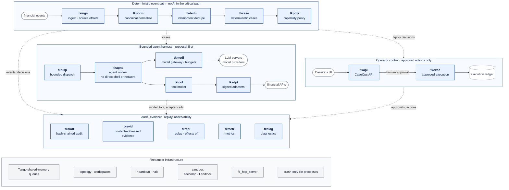

# Tickoni Tile Architecture

Target tile architecture: small single-purpose tiles with explicit links, a
deterministic event path with no AI in it, a bounded agent harness and operator
control beside it, every boundary event audited, all on Firedancer
infrastructure.

This diagram shows architecture, not delivery status. For what currently runs,
see [`tile-delivery-status.md`](../../execution/tile-delivery-status.md).

- Each external system is reachable only through its owning tile: model
  providers through `tkmodl`, financial APIs through `tkadpt`, the execution
  ledger through `tkexec`, and the CaseOps UI through `tkapi`.
- `tkexec` acts only after a `tkpoly` decision and human approval.
- `tkrepl` replays captured capsules with external effects disabled.

## Sources

- [`tile-topology.md`](../tile-topology.md): tile IDs, responsibilities, event
  flow, reuse boundary
- [`tile-orchestration.md`](../tile-orchestration.md): lifecycle, heartbeat,
  crash-only behavior, Firedancer substrate reuse
- [`architecture.md`](../architecture.md): system layers, governed external
  systems, AI outside the deterministic critical path
