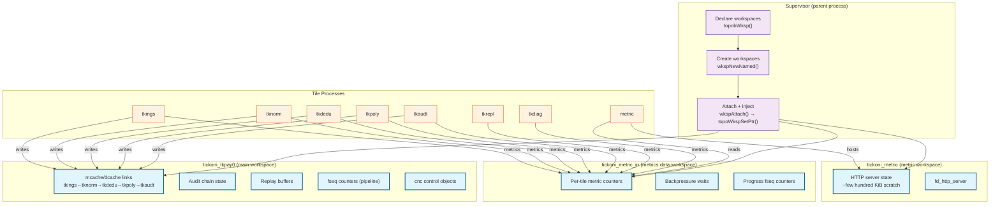

# Tickoni Workspace Management

Workspaces are the memory backing for Firedancer's shared-memory objects: mcache,
dcache, fseq, metrics, cnc, and tile state. They isolate tile memory from the
operating system and from each other. This doc covers workspace creation,
backing strategy, the Firedancer vs Tickoni divergence, the supervisor's
three-workspace pattern, and the lifecycle from declaration to tile join.

For workspace **mapping modes** (shared, exclusive, partitioned), see
[tile-topology.md](tile-topology.md#workspace-mapping-modes).

For the **orchestration flow** (topology build → launch → run), see
[tile-orchestration.md](tile-orchestration.md).

## What Workspaces Are

A workspace (`fd_wksp_t`) is a contiguous region of process-shared memory backed
by a file on disk. It provides:

- **Address isolation**: each workspace has its own gaddr/laddr namespace
- **Footprint accounting**: objects know their exact byte offsets within a
  workspace
- **Allocation helpers**: `wkspAlloc`, `wkspAllocAtLeast` return gaddr values
  that map to laddr via `wkspLaddr`/`wkspGaddr`
- **Join semantics**: a process must explicitly join a workspace to use it

Firedancer validators create workspaces backed by hugetlbfs (huge/gigantic pages
requiring root privileges and `MAP_HUGE_*` mmap flags). Tickoni avoids this
requirement entirely by using normal 4 KiB pages.

## Backing Strategy: Normal Pages vs hugetlbfs

### Firedancer (validator mode)

Firedancer's `fd_topo_create_workspace()` (called from `fdctl`/`run.c`) creates
workspaces via `fd_wksp_new_named()` backed by hugetlbfs:

- `max_page_size` is computed from workspace footprint — gigantic if >8 MiB,
  huge otherwise
- Backed by `hugetlbfs` mount — requires root, `CAP_IPC_LOCK`, and kernel
  hugetlbfs configuration
- `fd_topo_join_workspace()` maps the hugetlbfs file into the process

This works for validator hardware (large, dedicated, Linux-only systems) but
blocks Tickoni from running on retail hardware, macOS, or Windows.

### Tickoni (normal-page mode)

Tickoni's C shim in `shim/topob.c` forces normal-page workspace allocation:

```c
// shim/topob.c — tk_topob_finish()
void tk_topob_finish( void * topo ) {
  ((fd_topo_t *)topo)->max_page_size = FD_SHMEM_NORMAL_PAGE_SZ;
  fd_topob_finish( (fd_topo_t *)topo, TK_CALLBACKS );
}
```

Setting `max_page_size = FD_SHMEM_NORMAL_PAGE_SZ` (4096) before the upstream
`fd_topob_finish()` prevents it from selecting huge/gigantic page sizes.

The supervisor creates workspaces via `wkspNewNamed()`:

```zig
// supervisor.zig — Phase 0 workspace creation
const wkspIdx = try c_abi.wksp.wkspNewNamed(
    name,
    c_abi.wksp.shmem_normal_page_sz,  // 4096
    1,                                   // sub_cnt
    &sub_page_cnt,                       // sub_page_cnt
    &sub_cpu_idx,                        // sub_cpu_idx
    0o600,                               // mode
    1,                                   // seed
    1,                                   // opt_part_max
);
```

`wkspNewNamed()` (via `tk_wksp_new_named()` shim) creates a file under the
`FD_SHMEM_PATH` directory (`.normal/`) with normal page size (4096). No hugetlbfs,
no root privileges, no kernel configuration needed.

The topology's workspace pointers are then injected:

```zig
// supervisor.zig — inject wksp pointers into topology
c_abi.topo.topoWkspSetPtr(topo, wkspIdx, wksp);
```

This replaces the `fd_wksp_t*` pointer in `topo->workspaces[wksp_idx]` with the
already-attached normal-page workspace handle, bypassing
`fd_topo_create_workspace()` entirely.

## The Three-Workspace Pattern

Phase 0 uses three workspaces:

| # | Workspace name | Purpose | Backed by |
|---|---|---|---|
| 1 | `tickoni_tkpay0` (main) | Event pipeline tiles — tkings, tknorm, tkdedu, tkpoly, tkaudt, tkrepl | Normal-page file (`.normal/`) |
| 2 | `tickoni_metric` | metric tile's own workspace (scratch, HTTP server state) | Normal-page file |
| 3 | `tickoni_metric_in` | Metrics data objects — written by all tiles, read by metric | Normal-page file |

### Why Three Workspaces?

Tickoni separates workspaces by **concern and access pattern** rather than creating one workspace per tile. This mirrors Firedancer's own separation of the `metric`/`metric_in` pair (see Firedancer `src/app/firedancer/topology.c` lines 421 and 454) and keeps Tickoni's footprint minimal.

**`tickoni_tkpay0`** (main workspace) — the correctness-bearing workspace. It hosts all mcache/dcache links (the tkings→tknorm→tkdedu→tkpoly→tkaudt pipeline), audit chain state, replay buffers, fseq progress counters, and cnc control objects. Every pipeline tile joins this workspace because correctness data flows through it.

**`tickoni_metric`** (metric tile workspace) — the metric tile's own scratch space. The metric tile has no mcache/dcache links; it only needs its own address space to host an embedded `fd_http_server` (a few hundred KiB: 4 connection slots, 256 KiB outgoing buffer) and its HTTP server state. It does **not** need the main workspace.

**`tickoni_metric_in`** (metrics data workspace) — a shared metrics data store. Every pipeline tile writes metrics samples (per-tile counters, fseq progress, backpressure waits) into this workspace. The metric tile reads them all to render Prometheus `/metrics`. By keeping metrics data in a separate workspace, the metric tile can read without contending on the main workspace's memory.

This separation yields three benefits:

1. **Isolation**: the metric tile crashes or OOMs don't corrupt correctness-bearing objects.
2. **Read-write separation**: pipeline tiles write metrics; only the metric tile reads them. No shared cache-line contention on counters.
3. **Minimal footprint**: instead of 7+ workspaces (one per tile), Tickoni uses 3. Each tile process only joins the workspaces it actually needs.

### How Workspaces Are Called (Zig API Pattern)

The supervisor follows a three-step pattern per workspace. Each step is called in sequence during topology bootstrap:

```zig
// 1. Declaration — topology builder records workspace name and returns index
const mainWkspIdx = c_abi.topo.topobWksp(topo, "tickoni_tkpay0");
const metricWkspIdx = c_abi.topo.topobWksp(topo, "tickoni_metric");
const metricInWkspIdx = c_abi.topo.topobWksp(topo, "tickoni_metric_in");

// 2. Creation — supervisor creates the real workspace from the declared name
//    (writes file under FD_SHMEM_PATH/.normal/{name}, sets page size)
const mainWksp = try c_abi.wksp.wkspNewNamed("tickoni_tkpay0", ...);
const metricWksp = try c_abi.wksp.wkspNewNamed("tickoni_metric", ...);
const metricInWksp = try c_abi.wksp.wkspNewNamed("tickoni_metric_in", ...);

// 3. Injection — supervisor attaches to the workspace and injects the pointer
//    into the topology so object callbacks can find it
try c_abi.wksp.wkspAttach("tickoni_tkpay0");
try c_abi.wksp.wkspAttach("tickoni_metric");
try c_abi.wksp.wkspAttach("tickoni_metric_in");
c_abi.topo.topoWkspSetPtr(topo, mainWkspIdx, mainWksp);
c_abi.topo.topoWkspSetPtr(topo, metricWkspIdx, metricWksp);
c_abi.topo.topoWkspSetPtr(topo, metricInWkspIdx, metricInWksp);
```

The topology builder (`topobWksp`) is a comptime-phase function — it runs once before the topology is built and returns a small integer index. The supervisor then calls `wkspNewNamed` to create the file-backed workspace, `wkspAttach` to map it into its own address space, and `topoWkspSetPtr` to inject the `fd_wksp_t*` pointer into the topology struct. This last step is critical: without it, the object callbacks (`.new` functions in `shim/topob.c`) cannot resolve workspace pointers during object initialization.

### Workspace Relationship Diagram



### Firedancer Comparison

Firedancer's validator topology creates ~35 workspaces depending on the config:

```
metric, diag, genesis, ipecho, gossvf, gossip, shred, repair,
replay, accdb, execrp, tower, txsend, sign, admin,
quic, verify, dedup, resolv, pack, execle, poh,
event_in, ...
```

The `metric`/`metric_in` pair appears in Firedancer at:
- `src/app/firedancer/topology.c` line 421: `fd_topob_wksp(topo, "metric")`
- `src/app/firedancer/topology.c` line 454: `fd_topob_wksp(topo, "metric_in")`
- `src/app/fdctl/topology.c` lines 50, 81: same pair in the topology builder

Firedancer's orchestrator (run.c, ~line 680) loops over all workspaces:

```c
for each workspace in config->topo.workspaces[]:
  fd_topo_create_workspace(&config->topo, wksp, update_existing);  // hugetlbfs
  fd_topo_join_workspace(&config->topo, wksp, RDWR, 0);
  fd_topo_wksp_new(&config->topo, wksp, CALLBACKS);                // .new callbacks
  fd_topo_leave_workspace(&config->topo, wksp);
```

Tickoni's supervisor does the same three-step pattern but with normal-page
workspaces:

```zig
for each workspace (main, metric, metric_in):
  wkspNewNamed(name, ...)       // normal-page file
  wkspAttach(name)              // map into address space
  topoWkspSetPtr(topo, idx)     // inject pointer into topology
```

## Lifecycle: From Declaration to Tile Join

The workspace lifecycle has four phases:

### Phase 1: Declaration (topology builder)

`topobWksp()` (via `tk_topob_wksp()`) declares a workspace by name in the
topology. It returns the workspace index. Objects (mcache, dcache, fseq,
metrics, cnc) are then associated with workspaces via `topobObj()`.

```zig
const mainWkspIdx = c_abi.topo.topobWksp(topo, "tickoni_tkpay0");
const metricWkspIdx = c_abi.topo.topobWksp(topo, "tickoni_metric");
const metricInWkspIdx = c_abi.topo.topobWksp(topo, "tickoni_metric_in");
```

Objects are created with `topobObj(obj_type, wksp_name)`:

```zig
// Links create their own mcache/dcache objects
const linkId = c_abi.topo.topobLink(topo, "tkings_tknorm", "tickoni_tkpay0", depth, mtu, burst);
```

### Phase 2: Footprint Computation (topob_finish)

`topobFinish()` calls `fd_topob_finish()` which:

1. Computes object footprints via the 6-entry callback array (mcache, dcache,
   fseq, metrics, tile, cnc)
2. Assigns offsets within each workspace (NUMA-aware packing)
3. Computes total footprint per workspace
4. Sets `max_page_size = NORMAL` (preventing hugetlbfs selection)

The callbacks live in `shim/topob.c`:

```c
static fd_topo_obj_callbacks_t * TK_CALLBACKS[] = {
    &tk_obj_cb_mcache,
    &tk_obj_cb_dcache,
    &tk_obj_cb_fseq,
    &tk_obj_cb_metrics,
    &tk_obj_cb_tile,
    &tk_obj_cb_cnc,
    NULL,
};
```

Each callback provides `.footprint`, `.align`, and `.new` (initializer) for its
object type.

### Phase 3: Workspace Creation and Injection

The supervisor creates real workspaces and injects their pointers:

```zig
// 1. Create normal-page workspace
const wkspIdx = try c_abi.wksp.wkspNewNamed(name, page_sz, ...);

// 2. Attach to address space
const wksp = try c_abi.wksp.wkspAttach(name);

// 3. Inject into topology (bypasses fd_topo_create_workspace)
c_abi.topo.topoWkspSetPtr(topo, wkspIdx, wksp);
```

This replaces the `wksp` pointer in `topo->workspaces[wksp_idx]` so that
`fd_topo_obj_laddr()` and the `.new` callbacks can find the workspace.

### Phase 4: Tile Join

Each tile process joins only the workspaces it needs:

```c
// topo_run.c — fd_topo_run_tile()
fd_topo_join_tile_workspaces(topo, tile, core_dump_level);  // join needed wksp
fd_topo_fill_tile(topo, tile);                               // fill mcache/dcache/fseq
tile_run->unprivileged_init(topo, tile);
tile_run->run(topo, tile);
```

`fd_topo_join_tile_workspaces()` joins:
- The tile's own workspace (`tile->wksp_id`)
- The metrics workspace (`tile->metrics_wksp_id`)
- Any workspace where the tile's links reside

After joining, `fd_topo_fill_tile()` maps the tile's mcache/dcache/fseq pointers
from the topology objects into the tile's local address space.

### Readiness Markers — Why They Exist

The readiness marker is a synchronization primitive used by Tickoni's process-mode
launcher to prevent a race condition between workspace creation and tile join.

**What it is:** A `.ready` file placed in the workspace's backing directory
(`{shmem_path}/.normal/{concrete_wksp_name}.ready`). The tile process polls for
this file before attempting `fd_wksp_join`. If the marker is absent after a
short timeout, the tile aborts.

**Why Tickoni needs it:** Tickoni creates workspaces via `wkspNewNamed()` backed
by **normal 4 KiB pages** written to the private shmem directory. This uses
standard file operations (open + ftruncate + mmap), which are **asynchronous** at
the kernel level — the file exists on disk but the kernel's delayed commit may
not have flushed it yet. When a tile child process calls `fd_shmem_join` to map
the workspace file, the kernel may not have committed it, and `fd_shmem_join`
returns ENOENT.

The readiness marker ensures the supervisor has completed the workspace file
creation and synced it to disk before tiles attempt to join.

**Why Firedancer does not need it:** Firedancer creates workspaces via
`fd_topo_create_workspace()` backed by **hugetlbfs** (huge/gigantic pages).
Hugepages are a kernel-managed filesystem — `ftruncate` and `fallocate` on
hugetlbfs are **synchronous**. By the time `fd_topo_create_workspace` returns,
the file is guaranteed to exist on disk and is immediately joinable by child
processes. Firedancer's orchestrator completes workspace creation for all
workspaces, then launches all tile processes simultaneously — there is no race.

**Future direction:** Readiness markers are a workaround for normal-page shmem's
async commit semantics. They can be eliminated by calling `fsync()` on the
workspace file after `wkspNewNamed()` completes, or by migrating to a synchronous
backing mechanism. Removing them reduces coupling to non-Firedancer patterns and
aligns Tickoni closer to the upstream workspace lifecycle.

## Object Callbacks

The 6-entry callback array replaces Firedancer's `src/app/shared/fd_obj_callbacks.c`
to avoid coupling to `fdctl_tile_run()`. Each callback type has:

| Callback type | Footprint | Align | New |
|---|---|---|---|
| **mcache** | `fd_mcache_footprint(depth, 0)` | `fd_mcache_align()` | `fd_mcache_new(laddr, depth, 0, 0)` |
| **dcache** | `fd_dcache_footprint(data_sz, app_sz)` | `fd_dcache_align()` | `fd_dcache_new(laddr, data_sz, app_sz)` |
| **fseq** | `fd_fseq_footprint()` | `fd_fseq_align()` | `fd_fseq_new(laddr, ULONG_MAX)` |
| **metrics** | `FD_METRICS_FOOTPRINT(in_cnt)` | `FD_METRICS_ALIGN` | `fd_metrics_new(laddr, in_cnt)` |
| **tile** | 1UL (or custom scratch) | 1UL | NULL (no scratch for Phase 0) |
| **cnc** | `fd_cnc_footprint(64)` | `fd_cnc_align()` | `fd_cnc_new(laddr, 64, cnc_type, ts)` |

The "tile" callback returns 1UL (minimum footprint, required by NUMA assignment)
unless the tile has a custom scratch footprint (currently only metric). The "cnc"
callback is Tickoni-owned — Firedancer has no built-in cnc concept; it's added
as a real offset-accounted object via the topology builder.

## Metric Tile Workspace Details

The metric tile (`metric`) is the only tile that explicitly needs two workspaces
to function:

- **Own workspace** (`tickoni_metric`): hosts the tile's process context and
  scratch region (a few hundred KiB: 4 connections, 256 KiB out buffer, allocated as a "tile" object with custom footprint
  set via `topobSetObjPropertyUlong("tickoni.scratch_footprint")`)
- **Metrics data workspace** (`tickoni_metric_in`): hosts all metrics objects
  written by every pipeline tile

The tile is declared with `fd_topob_tile(topo, "metric", "tickoni_metric",
"tickoni_metric_in", cpu_idx)` — first workspace parameter is the tile's own
workspace, second is where metrics objects live.

The metric tile runs an embedded `fd_http_server` on a configurable port that
renders Prometheus `/metrics` from the metrics workspace. It has zero
mcache/dcache links — it's a pure observer, reading metrics data from
`tickoni_metric_in` and serving `/metrics` to external consumers. Its scratch
workspace is small (a few hundred KiB: 4 connection slots, 256 KiB outgoing
buffer) and hosts the HTTP server state. The `metric_tile_obj_id` field in
`BuiltTopo` carries the object ID for this scratch workspace.

## Reuse Boundary

| Pattern | Firedancer | Tickoni |
|---|---|---|
| Topology builder (`fd_topob_*`) | Reused | Reused via `c_abi/topo.zig` + `shim/topob.c` |
| Workspace creation | `fd_topo_create_workspace()` → hugetlbfs | `wkspNewNamed()` → normal pages |
| Workspace join | `fd_topo_join_workspace()` | `topoJoinWorkspaces()` |
| Object callbacks | `src/app/shared/fd_obj_callbacks.c` | `shim/topob.c` (6-entry array, no fdctl coupling) |
| Tile launch | `fd_topo_run_tile()` | `tile_process.zig` (parallel implementation) |
| Workspace backing | hugetlbfs (root, Linux-only) | normal pages (4 KiB, cross-platform) |
| Workspace count | ~35+ (validator-dependent) | 3 (Phase 0) |

## Testing Expectations

Process-mode workspace validation should include:

- Malformed or stale workspace identifiers
- Wrong workspace join modes (read-only vs read-write)
- Missing queue/control objects after workspace join
- dcache bounds errors
- Link depth/MTU/burst mismatches
- Non-advancing reliable consumers
- Forced tile crashes that leave shared-memory state readable for diagnostics
- Normal-page workspace sizing vs `topoWkspFootprint()` computed values

## Key Files

| File | Role |
|---|---|
| `src/tickoni/c_abi/wksp.zig` | Zig wrappers for `wkspNewNamed`, `wkspAttach`, `wkspAlloc`, `wkspLaddr`, `wkspGaddr` |
| `src/tickoni/c_abi/topo.zig` | Zig wrappers for topology workspace ops: `topoWkspSetPtr`, `topoWkspFootprint`, `topoJoinWorkspaces` |
| `src/tickoni/c_abi/shim/topob.c` | C shims for topology builder, callbacks, workspace injection |
| `src/app/tickoni/supervisor.zig` | Phase 0 supervisor — explicit `wkspNewNamed()` calls, readiness markers |
|| `src/disco/topo/fd_topo_run.c` | Firedancer tile launch — joins workspaces, fills tiles, enters sandbox (Linux only; see [platform-tiers.md](platform-tiers.md) for the Linux-only sandbox breakdown) |
| `src/app/firedancer/topology.c` | Firedancer workspace declarations (`metric`, `metric_in`, ~30 others) |
| `src/disco/metrics/fd_metric_tile.c` | Metric tile — observer in `metric` wksp, reads from `metric_in` |

## Related Docs

- [Tile Topology](tile-topology.md) — tile IDs, link shapes, workspace mapping modes
- [Tile Orchestration](tile-orchestration.md) — topology build, launch, run lifecycle
- [Architecture](architecture.md) — Firedancer infrastructure layer, reuse boundary
- [Auth Tiles](auth-tiles.md) — keyswitch objects (not workspace-related, but uses same topology infrastructure)
